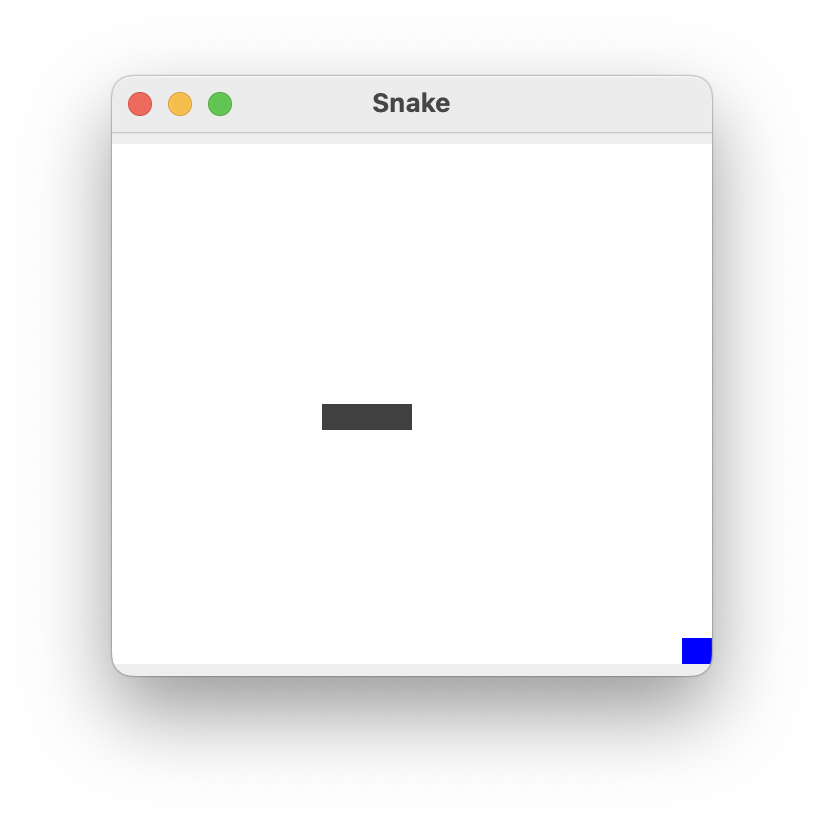

# Snake

A simple clone of the classic game Snake.
This game is developed in Java and uses threads as well as swing.
I have commented the code to best of my abilities, if you have any questions feel free to reach out to me.

## Game


## How to play
- Download Snake.jar or Executable/App from releases
- Run it with ```java -jar Snake.jar```
- Start playing with the arrows keys. 

## Development

Contributions are welcome, please try to follow the general code style.

### Requirements
- Java Runtime
- IDE/Text Editor
- Git

## Support the developer
<a href="https://www.lostrabbitdigital.org/support/" target="_blank"></a>
